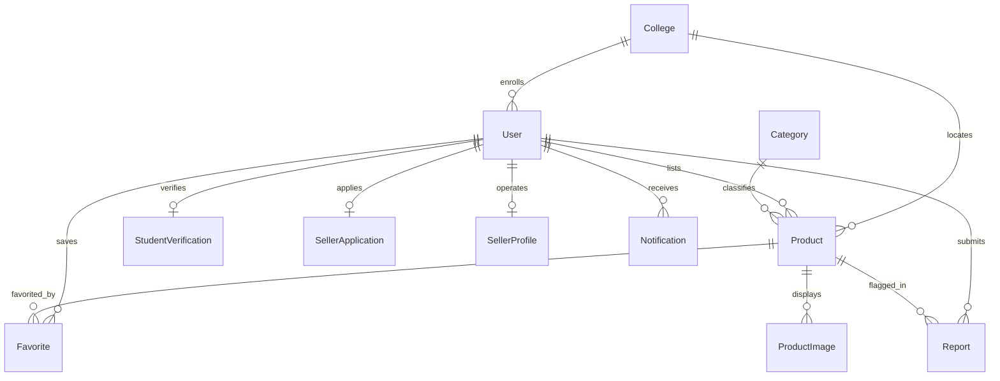

# 🚀 UNISpaceX — Campus Marketplace & Student Business Network

> **“Your Campus. Your Marketplace. Your Space.”**  
> A trusted digital marketplace built specifically for the university community.

---

## 📌 1. Product Overview

**UNISpaceX** is a modern, student-focused campus marketplace and business network where verified college students can discover, buy, sell, exchange, and promote products and services within their collegiate ecosystem.

Traditional online marketplaces expose students to anonymous scammers, high shipping fees, and safety risks. UNISpaceX solves this through:
- **Verified Student Identity**: Integration with **SheerID** (with a seamless local mock mode for zero-cost development) ensuring only legitimate enrolled students participate.
- **Verified Seller Ecosystem**: Multi-stage review process (Student Verification $\rightarrow$ Seller Application $\rightarrow$ Admin Review & ID verification $\rightarrow$ **✓ Verified Seller** Badge).
- **Direct Campus-Safe Transactions**: Smart campus location tags, dynamic privacy-preserving WhatsApp routing, and face-to-face dorm/quad exchanges.
- **Student Entrepreneurship**: Custom storefronts for student creators, developers, designers, bakers, and freelancers.
- **Full Moderation & Audit System**: Reports, suspensions, listing moderation, and platform announcements.

---

## 🛠️ 2. Technology Stack

- **Framework**: [Next.js 14](https://nextjs.org/) (App Router, Server-Side Rendering, Server Actions & API Route Handlers)
- **Frontend**: [React 18](https://react.dev/), [TypeScript](https://www.typescriptlang.org/), [Tailwind CSS](https://tailwindcss.com/), [Lucide React Icons](https://lucide.dev/)
- **Database & ORM**: [Prisma ORM 5](https://www.prisma.io/) with SQLite for local development (`dev.db`) and instant PostgreSQL compatibility for production (Supabase, Neon, AWS RDS)
- **Authentication**: JWT session tokens with HTTP-only, `SameSite=Lax`, secure cookies and `bcryptjs` password hashing
- **Validation**: [Zod](https://zod.dev/) type-safe runtime schemas across all client and API boundaries
- **Student Verification**: Pluggable `StudentVerificationService` abstraction supporting both **SheerID official API** and **Mock Verification** mode
- **Storage**: Multi-provider storage abstraction (`LocalStorageProvider`, `S3StorageProvider`, `CloudinaryStorageProvider`)

---

## 🗄️ 3. Relational Data Models (Prisma)



### Core Entities:
- **`User`**: Id, name, email, passwordHash, role (`STUDENT` | `SELLER` | `ADMIN`), collegeId, phone, avatar, isSuspended.
- **`College`**: Name, domain (e.g., `saec.ac.in`, `stanford.edu`), city, state, country, isActive.
- **`StudentVerification`**: Provider (`sheerid` | `mock`), status (`NOT_STARTED` | `PENDING` | `VERIFIED` | `FAILED` | `EXPIRED`), documentUrl, expiresAt.
- **`SellerApplication`**: Government ID, WhatsApp number, seller description, status (`PENDING` | `UNDER_REVIEW` | `APPROVED` | `REJECTED`), adminNotes.
- **`SellerProfile`**: Business name, bio, rating, totalSales, isApproved.
- **`Product`**: Title, slug, description, price, condition (`NEW` | `LIKE_NEW` | `GOOD` | `USED`), quantity, campusLocation, status (`ACTIVE` | `PENDING` | `SOLD` | `REJECTED`), views, isFeatured.
- **`ProductImage`**: Image URL, thumbnail URL, display order.
- **`Category`**: Name, slug, icon, description, displayOrder.
- **`Favorite`**: User-to-Product bookmarking.
- **`Report`**: Listing reports with reason (`SCAM`, `FAKE_PRODUCT`, `INAPPROPRIATE`, `SPAM`, `OTHER`), status (`PENDING`, `INVESTIGATING`, `RESOLVED`, `DISMISSED`).
- **`Notification`**: Real-time user alerts for approvals, rejections, sales, and announcements.
- **`Announcement`**: Platform-wide broadcasts with priority styling.
- **`AuditLog`**: Administrative event tracking for security and accountability.

---

## ⚡ 4. Quick Start & Setup

### Prerequisites
- Node.js >= 18.17.0 (v20+ or v24+ recommended)
- npm >= 9.0.0

### Step 1: Install Dependencies
```bash
npm install
```

### Step 2: Configure Environment Variables
Copy `.env.example` to `.env`:
```bash
cp .env.example .env
```
Default `.env` configuration:
```env
# Database (SQLite for zero-config dev; change to postgresql:// for production)
DATABASE_URL="file:./dev.db"

# Authentication
AUTH_SECRET="unispace-secure-secret-key-32-chars-long-at-least"
NEXT_PUBLIC_APP_URL="http://localhost:3000"

# Verification Mode ("mock" for instant development, "sheerid" for production)
VERIFICATION_MODE="mock"
SHEERID_API_KEY=""
SHEERID_CLIENT_ID=""

# Default Admin Credentials
ADMIN_EMAIL="admin@unispace.edu"
ADMIN_PASSWORD="AdminPassword123!"
```

### Step 3: Run Database Migrations & Seed Data
```bash
npm run db:setup
```
This automated command:
1. Generates Prisma client types (`prisma generate`).
2. Pushes the schema to the database (`prisma db push`).
3. Seeds **4 colleges**, **21 realistic student/seller accounts**, **5 approved sellers**, **20 campus products**, **12 categories**, sample reports, and announcements.

### Step 4: Start the Development Server
```bash
npm run dev
```
Open [http://localhost:3000](http://localhost:3000) in your browser.

---

## 🔑 5. Seed Accounts & Credentials

All default seed accounts use the password: `Password123!` (Admin password: `AdminPassword123!`).

| Role | Email | College | Verification Status | Features |
|---|---|---|---|---|
| **Admin** | `admin@unispace.edu` | Campus Administration | Platform Admin | Full Admin Dashboard, Moderation, User/Seller management |
| **Verified Seller** | `mohamed@saec.ac.in` | SA Engineering College | **✓ Verified Seller** | Electronics & Engineering tools storefront |
| **Verified Seller** | `elena@stanford.edu` | Stanford University | **✓ Verified Seller** | Textbooks, Apple devices, Dorm essentials |
| **Verified Student** | `alex@stanford.edu` | Stanford University | **✓ Verified Student** | Active buyer with saved favorites |
| **New Student** | `priya@mit.edu` | MIT | Unverified / Pending | Ready to test SheerID verification flow |

---

## 🔄 6. End-to-End 14-Step Demo Flow

Follow this comprehensive walkthrough to demonstrate all platform features:

1. **Visit Landing Page** (`/`):
   - Review hero section, statistics counter, value pillars, active campus categories, and featured listings.
2. **Register a Student Account** (`/register`):
   - Sign up with `teststudent@saec.ac.in`. Domain validation automatically matches the selected college.
3. **Complete Student Verification** (`/verify-student`):
   - Trigger the `StudentVerificationService`. In `VERIFICATION_MODE=mock`, click "Complete Instant Verification" to receive the green **✓ Verified Student** badge.
4. **Explore the Campus Marketplace** (`/marketplace`):
   - Browse listings across Electronics, Textbooks, Notes, Services, and Dorm Accessories.
5. **Search & Filter Listings**:
   - Type `"Calculator"` into the debounced search bar.
   - Toggle filters: "Condition: Like New", "Verified Sellers Only", and "Sort by Price".
6. **Inspect Product Details** (`/products/[id]`):
   - View high-resolution multi-angle image gallery, condition tag, seller trust badge, campus quad meeting point, and item description.
7. **Verify Seller Trustworthiness**:
   - Check the seller's joined date, college affiliation, total active listings, and community rating.
8. **Contact Seller via WhatsApp**:
   - Click **"Chat on WhatsApp"**. The platform generates a pre-formatted message (`"Hi, I'm interested in your listing on UNISpaceX..."`) without publicly exposing raw phone numbers.
9. **Save to Favorites**:
   - Click the heart icon on any listing. Open `/favorites` to verify real-time bookmarking.
10. **Apply to Become a Seller** (`/become-seller`):
    - Submit full name, college ID, WhatsApp contact, business description, and sample items. Status transitions to `UNDER_REVIEW`.
11. **Switch to Admin Account**:
    - Log out and log in as `admin@unispace.edu` / `AdminPassword123!`.
12. **Review Seller Applications in Admin Dashboard** (`/admin`):
    - Navigate to the **"Seller Applications"** tab. Inspect applicant details, credentials, and click **"Approve Seller"**.
    - The applicant role is automatically promoted to `SELLER`, creating a public `SellerProfile`.
13. **Create a New Listing** (`/products/new`):
    - Log back in as the newly approved seller.
    - Submit title, category, price, condition, campus pickup point, and upload product photos.
14. **Confirm Live Visibility in Marketplace**:
    - Return to `/marketplace` to see the new item immediately displayed with active seller credentials!

---

## 🛡️ 7. Student Verification Architecture (SheerID Integration)

UNISpaceX decouples verification logic via a clean service interface ([`services/verification/verification.interface.ts`](file:///d:/unispacex/services/verification/verification.interface.ts)):

```typescript
export interface StudentVerificationService {
  createVerificationSession(params: CreateSessionParams): Promise<VerificationSessionResult>;
  checkVerificationStatus(verificationId: string): Promise<VerificationStatusResult>;
  handleVerificationWebhook(payload: any, signature: string): Promise<WebhookResult>;
}
```

- **Mock Implementation** ([`mock-verification.ts`](file:///d:/unispacex/services/verification/mock-verification.ts)):
  Allows automated testing, staging demos, and offline presentations without paid API keys.
- **SheerID Official Implementation** ([`sheerid-verification.ts`](file:///d:/unispacex/services/verification/sheerid-verification.ts)):
  Connects to SheerID REST v2 endpoints (`https://services.sheerid.com/rest/v2/verification/program/...`), exchanges student credentials, and validates cryptographic webhook signatures.

Switch between modes at any time using `VERIFICATION_MODE=mock` or `VERIFICATION_MODE=sheerid`.

---

## 📡 8. REST API Reference

| Endpoint | Method | Role | Description |
|---|---|---|---|
| `/api/auth/register` | `POST` | Public | Register new college student account |
| `/api/auth/login` | `POST` | Public | Authenticate user & issue HTTP-only JWT |
| `/api/auth/logout` | `POST` | User | Terminate user session |
| `/api/auth/me` | `GET` | User | Fetch current authenticated user & unread count |
| `/api/colleges` | `GET` | Public | List active colleges and email domains |
| `/api/categories` | `GET` | Public | List marketplace categories with product counts |
| `/api/products` | `GET` | Public | Paginated marketplace query with multi-filter |
| `/api/products` | `POST` | Verified Seller | Create new product listing |
| `/api/products/[id]` | `GET` | Public | Fetch product details & seller metadata |
| `/api/products/[id]` | `PUT` / `DELETE` | Owner / Admin | Edit or remove listing |
| `/api/students/verification/session` | `POST` | Student | Initialize SheerID or mock verification session |
| `/api/students/verification/verify` | `POST` | Student | Complete verification & issue verified badge |
| `/api/sellers/apply` | `POST` | Verified Student | Submit seller application |
| `/api/sellers/status` | `GET` | Student | Fetch active application state |
| `/api/favorites` | `GET` / `POST` | Student | View and toggle saved products |
| `/api/reports` | `POST` | Student | Report spam, counterfeit, or scam listings |
| `/api/admin/analytics` | `GET` | Admin | Real-time platform KPI statistics |
| `/api/admin/sellers` | `GET` / `PATCH` | Admin | Review, approve, or reject seller applications |
| `/api/admin/products` | `GET` / `PATCH` | Admin | Moderate listings or change featured status |
| `/api/admin/reports` | `GET` / `PATCH` | Admin | Resolve or dismiss listing flags |
| `/api/admin/users` | `GET` / `PATCH` | Admin | Suspend, reactivate, or delete user accounts |

---

## 🔒 9. Security & Hardening

1. **Server-Side Authorization**: Every protected API route enforces cryptographic session verification via `getCurrentUser()` before executing business logic.
2. **Role-Based Access Control (RBAC)**: Admin endpoints enforce strict `role === "ADMIN"` verification.
3. **No Plaintext Passwords**: Uses `bcryptjs` with salt rounds = 10.
4. **Secure Image Processing**: Multi-part upload validates file size ($\le 5\text{MB}$), allows only image MIME types (`image/jpeg`, `image/png`, `image/webp`), and stores unique timestamped hashes.
5. **No Secret Leaks**: Password hashes, JWT secrets, and admin keys are never serialized to client responses.

---

## 🚀 10. Production Deployment Guide

### Deploying on Vercel:
1. Push repository to GitHub or GitLab.
2. Import project into [Vercel](https://vercel.com).
3. Connect a PostgreSQL database (e.g. Neon, Supabase, or AWS RDS).
4. Update `prisma/schema.prisma`:
   ```prisma
   datasource db {
     provider = "postgresql"
     url      = env("DATABASE_URL")
   }
   ```
5. Set environment variables in Vercel project settings (`DATABASE_URL`, `AUTH_SECRET`, `NEXT_PUBLIC_APP_URL`, `VERIFICATION_MODE`, `SHEERID_API_KEY`).
6. Deploy! Vercel will run `prisma generate && next build` automatically.

---

## 📄 License
This project is licensed under the MIT License — built for collegiate communities worldwide.
